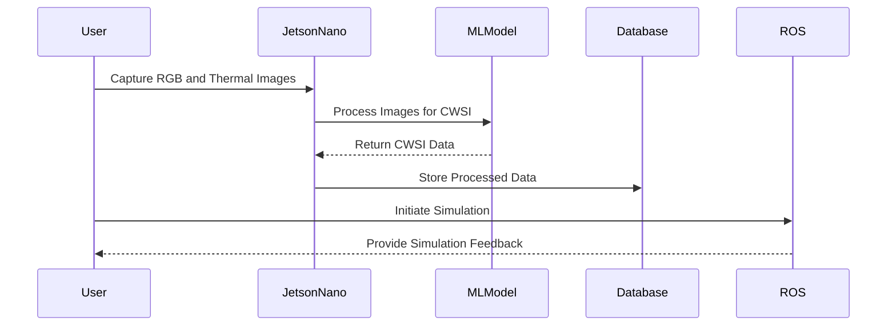

# CWSIJetsonNano: Revolutionizing Agricultural Monitoring


## Overview

CWSIJetsonNano is an innovative project designed to enhance agricultural monitoring through advanced image processing and machine learning techniques. By leveraging the power of NVIDIA's Jetson Nano, this project aims to provide real-time insights into crop health, enabling precision agriculture and sustainable farming practices.

## Architecture & Workflow

CWSIJetsonNano utilizes a combination of Jupyter Notebooks for image processing, ROS for robotic simulations, and machine learning models to analyze crop data. The system architecture is designed to seamlessly integrate thermal and RGB imaging to compute the Crop Water Stress Index (CWSI), providing critical data for irrigation management.



## Granular Tech Stack

- **Languages**: Python, Jupyter Notebook
- **Frameworks**: ROS (Robot Operating System)
- **Libraries**: OpenCV, NumPy, TensorFlow
- **Tools**: NVIDIA Jetson Nano, Gazebo for simulation

## Key Features

- Real-time RGB and thermal image processing
- Crop Water Stress Index calculation
- Integration with robotic simulation environments
- Automated conversion of RGB to grayscale and thermal images
- Extensible for various agricultural datasets

## Project Structure

```
CWSIJetsonNano/
├── For_Agribot (1).ipynb
├── LICENSE
├── ML CUSTOM PROTOTYPE/
│   └── For_Agribot (1).ipynb
├── Plant Dataset SRM.zip
├── README.md
├── RGB_Grayscale_Thermal.ipynb
├── RGB_to_Grayscale_Conversion.ipynb
├── RGB_to_Thermal_automated_Conversion.ipynb
├── ROS/
│   ├── four_ws_control.zip
│   └── gazebo_simulation.zip
└── temp1.ipynb
```

## Getting Started

### Prerequisites

- NVIDIA Jetson Nano Developer Kit
- Python 3.x
- Jupyter Notebook
- ROS installed on your system

### Installation

Clone the repository:

```bash
git clone https://github.com/yourusername/CWSIJetsonNano.git
cd CWSIJetsonNano
```

Install the required Python packages:

```bash
pip install -r requirements.txt
```

### Running the Project

Launch Jupyter Notebook:

```bash
jupyter notebook
```

Open and run the `For_Agribot (1).ipynb` notebook to start processing images.

## Usage

- Use the `RGB_to_Grayscale_Conversion.ipynb` notebook to convert RGB images to grayscale.
- Utilize `RGB_to_Thermal_automated_Conversion.ipynb` for automated thermal conversion.
- Run simulations using the files in the `ROS` directory.

## Roadmap

- [ ] Implement real-time data visualization dashboard
- [ ] Expand compatibility with additional agricultural datasets
- [ ] Develop mobile application for remote monitoring
- [ ] Enhance machine learning models for better accuracy

## Contributing

We welcome contributions from the community! Please fork the repository and submit a pull request for any enhancements or bug fixes.

## License

This project is licensed under the MIT License - see the [LICENSE](LICENSE) file for details.
